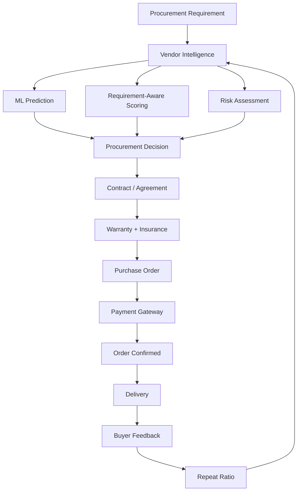

# ProcuraIQ

> AI-Assisted Procurement Decision Intelligence Platform

ProcuraIQ helps organizations choose the right vendor—not simply the cheapest vendor—by combining ML prediction, requirement-aware scoring, supplier risk, financial exposure, contractual protection, payment execution, and post-purchase vendor intelligence.

---

## 🎯 The Problem

Traditional procurement decisions often rely on:
- Price comparison
- Static vendor ratings
- Manual vendor evaluation
- Limited visibility into supplier risk
- Poor visibility into financial exposure
- Difficulty explaining why a vendor was selected

Cheapest vendor does not necessarily mean best vendor.

ProcuraIQ addresses this by combining prediction, business priorities, risk, financial exposure, protection, payment, and post-purchase intelligence into a single, cohesive platform.

---

## 💡 The Solution

The core decision flow of ProcuraIQ is:

**Predict → Prioritize → Assess Risk → Explain → Decide**

The product is evolving into a complete procurement lifecycle platform that covers:
Requirement → Vendor Intelligence → Prediction → Scoring → Risk → Protection → Purchase → Payment → Delivery → Feedback → Vendor Intelligence

---

## ⭐ KEY USPs

### 1. Predictive Vendor Intelligence
A Random Forest model predicts the procurement outcome (success/failure) using structured procurement data and historical vendor features. The model is trained to ensure no target-derived feature leakage.

### 2. Requirement-Aware Vendor Ranking
Vendor ranking adapts to specific procurement priorities, including:
- Delivery
- Quality
- Price
- Lead time
- Payment terms

The scoring engine evaluates vendors based on these priorities, ensuring that the same inputs deterministically produce consistent rankings.

### 3. Multi-Dimensional Risk Intelligence
Risk is comprehensively evaluated and broken down into distinct components:
- Delivery Risk
- Quality Risk
- Supplier Risk
- Payment Risk

The risk assessment also provides an Overall Risk score, a Supplier Health Score, and flags instances of low-confidence when insufficient historical data is present.

### 4. Money At Risk
*Status: IN PROGRESS*

ProcuraIQ translates procurement risk into financial exposure. This helps decision-makers understand not only which vendor to choose, but how much money is potentially at stake. 

Planned financial exposure components include:
- Price Risk
- Supplier Risk
- Payment / Advance Risk
- Delivery Risk
- Quality Risk

### 5. Contract & Procurement Protection
*Status: PLANNED*

Based on mentor feedback, the product roadmap incorporates critical protection measures:
- Agreements
- Terms and Conditions
- Buyer obligations
- Vendor obligations
- Code of Conduct
- Warranty
- Insurance

### 6. Payment & Procurement Execution
*Status: PLANNED*

The roadmap extends into the execution phase:
Vendor Selection → Contract Acceptance → Purchase Order → Payment → Order Confirmation

Payment gateway integration is targeted for Razorpay Test Mode.

### 7. Post-Purchase Vendor Intelligence
*Status: PLANNED*

The procurement loop closes with post-purchase intelligence:
- Buyer Feedback
- Warranty Claims
- Repeat Ratio
- Historical vendor intelligence

*Note on Repeat Ratio:* Calculated as Repeat Orders / Total Orders. This is utilized as a behavioral and relationship signal, though it is not automatically treated as definitive proof of satisfaction.

---

## 🔄 COMPLETE PROCUREMENT LIFECYCLE



---

## 🏗️ Architecture & Technology Stack

```text
React + Vite (Planned)
        ↓
FastAPI (Completed)
        ↓
Business Logic + ML (Completed)
        ↓
Supabase / PostgreSQL (Completed)
```

- **Frontend**: React, Vite *(In Progress)*
- **Backend**: FastAPI, Python *(Completed)*
- **Machine Learning**: Scikit-learn, Pandas, NumPy *(Completed)*
- **Database**: Supabase / PostgreSQL *(Completed)*

---

## 📊 Current Implementation Status

### COMPLETED & VERIFIED
- **Documentation**: Comprehensive foundation (9 documents)
- **Dataset**: 50,000 synthetic procurement transactions across 30 vendors and 10 categories (validated with historical feature leakage safeguards)
- **ML Artifacts**: Random Forest procurement outcome model (`model.joblib`), `feature_columns.json`
- **Backend**: FastAPI foundation with Supabase / PostgreSQL schema
- **API Endpoints**:
  - `GET /api/health` - System health check (HTTP 200 verified)
  - `POST /api/predict/` - Real model inference using `model.joblib` (HTTP 200 verified)
  - `POST /api/score/` - Deterministic vendor scoring and ranking (HTTP 200 verified)
  - `POST /api/risk/` - Deterministic multi-dimensional risk assessment engine (HTTP 200 verified across strong, medium, and weak vendor profiles)

### IN PROGRESS
- Money At Risk / Financial Exposure Engine
- Final Decision Engine
- Supabase backend data integration
- Frontend (React + Vite) and API integration
- End-to-end testing and Deployment

---

## 🚀 Local Setup

1. Clone the repository.
2. Install dependencies: `pip install -r backend/requirements.txt`
3. Run the backend locally: `uvicorn backend.main:app --reload`
4. Run verification tests: `python test_score.py` or `python test_risk.py`

*Note: The project requires local environment variables for configuration. See `.env.example`. Never commit actual credentials to version control.*