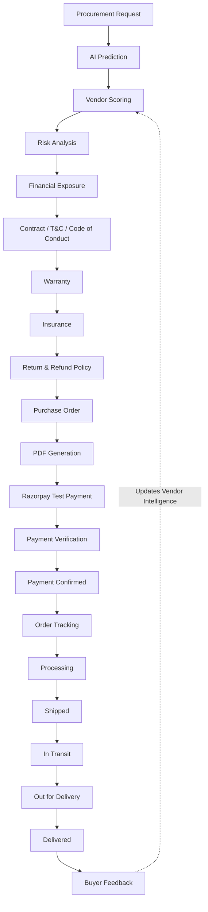
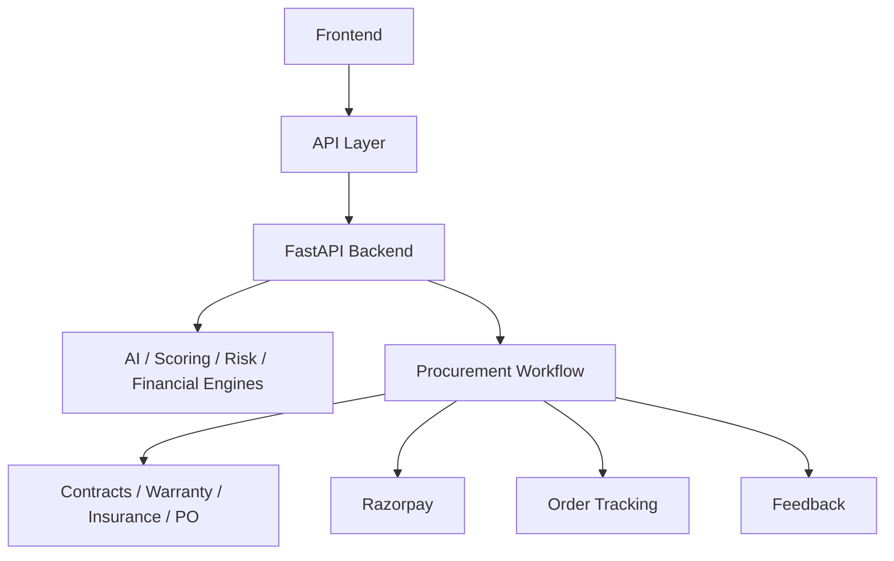

# ProcuraIQ

> AI-Assisted Procurement Decision Intelligence Platform

ProcuraIQ does not stop at predicting the best vendor. It connects prediction, risk, financial exposure, transaction protection, payment, fulfillment tracking, and post-purchase feedback into one procurement workflow.

---

## 🎯 The Problem

Traditional procurement decisions often rely on:
- Price comparison
- Static vendor ratings
- Manual vendor evaluation
- Limited visibility into supplier risk
- Poor visibility into financial exposure
- Difficulty explaining why a vendor was selected

Cheapest vendor does not necessarily mean best vendor.

ProcuraIQ addresses this by combining prediction, business priorities, risk, financial exposure, protection, payment, and post-purchase intelligence into a single, cohesive platform.

---

## 💡 The Solution / USP

The core decision flow of ProcuraIQ is:

**Predict → Prioritize → Assess Risk → Explain → Decide → Execute → Track**

### Strong Differentiation:
1. AI-driven vendor recommendation
2. Risk-aware procurement
3. Money-at-Risk quantification
4. Transaction protection through contracts, warranty and insurance
5. Integrated payment and procurement workflow
6. Post-purchase tracking and feedback
7. End-to-end procurement lifecycle instead of only vendor prediction

---

## 🔄 COMPLETE PROCUREMENT WORKFLOW

---

## 🏗️ Architecture Stack

- **Frontend**: React, Vite *(In Progress)*
- **API Layer**: Centralized strictly typed TypeScript client *(Completed)*
- **Backend**: FastAPI, Python *(Completed)*
- **Machine Learning**: Scikit-learn, Pandas, NumPy *(Completed)*
- **PDF Generation**: ReportLab *(Completed)*

---

## 🚀 Feature Capabilities

| Capability | Status |
|---|---|
| AI Procurement Prediction | Implemented |
| Vendor Scoring | Implemented |
| Risk Engine | Implemented |
| Financial Exposure | Implemented |
| Contracts & T&C | Implemented |
| Code of Conduct | Implemented |
| Warranty Plans | Implemented |
| Insurance | Implemented |
| Order Repeat Ratio | Implemented |
| Buyer Feedback | Implemented |
| Purchase Orders | Implemented |
| PO PDF | Implemented |
| Return & Refund Policy | Implemented |
| Razorpay Test Mode | Implemented |
| Payment Verification | Implemented |
| Order Tracking | Implemented |
| Simulated Live Location | Frontend Prototype |

---

## 💳 Payment Gateway

ProcuraIQ integrates Razorpay in **TEST MODE**. 

**Flow:**
`Purchase Order` → `Create Razorpay Order` → `Razorpay Test Checkout` → `Server-side Signature Verification` → `Purchase Order marked PAID` → `Order Tracking marked PAYMENT_CONFIRMED`

**Security Points:**
- Razorpay Key Secret remains strictly server-side.
- Payment amount is calculated from the server-side Purchase Order.
- Frontend cannot override or tamper with the payment amount.
- Payment is not marked successful without cryptographic signature verification.
- No real money is processed in Test Mode.

---

## 📦 Order Tracking

The procurement cycle operates on a deterministic lifecycle tracking system:

`PENDING_PAYMENT` → `PAYMENT_CONFIRMED` → `PROCESSING` → `SHIPPED` → `IN_TRANSIT` → `OUT_FOR_DELIVERY` → `DELIVERED`

- **Tracking History**: A full timestamped log of all transitions is maintained.
- **Expected Delivery Date**: Calculated and exposed per order.
- **Invalid Transition Protection**: The backend rigidly enforces lifecycle steps, preventing illogical jumps (e.g. `DELIVERED` → `PROCESSING` or jumping over `PAYMENT_CONFIRMED`).

### 📍 Shipment Location
The frontend will provide a simulated live shipment location experience for demonstration purposes. 
*Note: Shipment location is simulated in the prototype. Production deployment can integrate real logistics/carrier GPS APIs.*

---

## 🔁 Return & Refund
Purchase Orders can contain deterministic Return & Refund Policies covering:
- Return window
- Eligible return conditions
- Refund method
- Refund processing time
- Return shipping responsibility
- Restocking fee
- Non-returnable conditions

The policy is also directly rendered and included in the generated Purchase Order PDF.

---

## ⭐ Buyer Feedback
Buyers can submit post-purchase feedback after an order is marked `DELIVERED`. 

**Ratings collected:**
- Overall
- Quality
- Delivery
- Responsiveness
- Optional Comments

**Vendor Feedback Summaries provide:**
- Feedback count
- Average overall rating
- Average quality rating
- Average delivery rating
- Average responsiveness rating

---

## 🎬 Demo Flow

1. Enter procurement requirement
2. ProcuraIQ predicts/recommends vendor
3. Compare vendor score and risk
4. View Money At Risk
5. Configure contract, warranty and insurance
6. Review Return & Refund Policy
7. Generate Purchase Order
8. Download PO PDF
9. Proceed through Razorpay Test Mode
10. Verify payment
11. Track order
12. View simulated shipment location
13. Mark order delivered
14. Submit buyer feedback

---

## 🧪 Testing

The backend modules have dedicated deterministic test suites. The latest complete test run (including risk, financial, contracts, warranty, insurance, repeat ratio, feedback, purchase orders, tracking, and payments) passed successfully.

*(Note: When running tests via `pytest` or `python test_*.py`, you may observe a `StarletteDeprecationWarning` regarding `TestClient` from FastAPI—this is a non-blocking internal framework warning and not an application failure.)*

---

## 🚀 Local Setup

1. Clone the repository.
2. Setup the environment: `pip install -r backend/requirements.txt`
3. Configure the `.env` (See `.env.example`).
4. Run the backend locally: `uvicorn backend.main:app --reload`
5. Run verification tests: `pytest`

*Note: The project requires local environment variables for configuration. Never commit actual credentials to version control.*