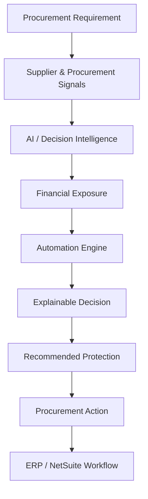
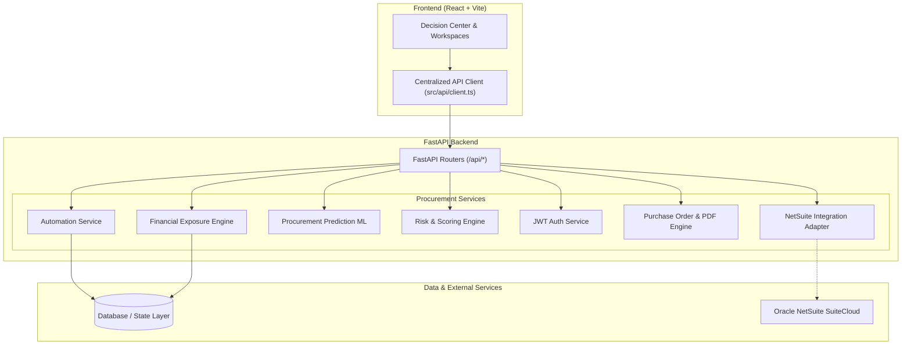

# ProcuraIQ

> **AI-Powered Procurement Decision Intelligence**

ProcuraIQ does not stop at detecting procurement risk. It converts procurement signals into measurable financial exposure, explains **WHY** the exposure exists, and recommends **WHAT ACTION** the procurement team should take next.

---

## 📌 Problem

Traditional enterprise procurement systems are largely built to record, track, and process transactional purchase orders. While ERPs effectively maintain ledgers, procurement teams are still left with the heavy manual burden of interpreting disparate supplier signals:
- Quoted price anomalies versus market benchmarks
- Degraded supplier delivery and SLA track records
- Unhedged advance payment risks and downside capital exposure
- Unclear vendor reliability and quality variance

Because traditional systems tell teams only *what happened after the fact*, billions in potential cost savings and risk mitigation opportunities are missed before purchase commitment.

---

## 💡 Solution

ProcuraIQ transforms raw procurement data into real-time, explainable decision intelligence. Rather than offering passive dashboards or abstract risk indices, ProcuraIQ continuously evaluates supplier and procurement signals to provide:
- **Quantified Financial Exposure**: Live calculation of **Money At Risk** before commitment.
- **Explainable Decision Signals**: Root-cause transparency (e.g., price anomalies, lead-time variance, defect rates).
- **Supplier Intelligence**: Multi-dimensional supplier ranking against delivery SLA, price, and quality.
- **Automated Protection Playbooks**: Concrete mitigation actions (milestone-based payments, delivery SLA liquidated damages clauses, data-backed negotiation scripts).
- **Enterprise ERP Integration**: SuiteCloud-ready integration layer connecting decisions directly to purchase workflows.

---

## ⚡ Core USP

> **"From Risk Detection to Financial Exposure to Action."**

Traditional systems tell procurement teams **WHAT** happened.  
ProcuraIQ helps answer:
1. **What is financially exposed?** — Immediate visibility into unhedged capital before purchase order creation.
2. **Why is it exposed?** — Explainable signal breakdowns (price anomalies, delivery degradation, payment terms).
3. **What should we do next?** — Prescriptive protection actions rather than blunt supplier rejections.

---

## 🔄 How It Works



---

## 🚀 Key Features

- **Decision Center**: Hero command dashboard highlighting Money At Risk, explainable risk flags, and dynamic mitigation actions.
- **Procurement Intelligence**: Machine learning prediction modeling delivery probability, lead-time variance, and outcome risk.
- **Supplier Discovery**: Multi-vendor search scored deterministically against verified on-time rates, quality scores, and price indices.
- **Supplier Comparison**: Multi-dimensional scorecards comparing composite scores, unit costs, delivery reliability, and financial exposure.
- **Benchmark Analysis**: Market median price tracking, category variance analysis, and immediate savings identification.
- **Savings Intelligence**: Audit trail of realized value capture, price variance recapture, and protected capital.
- **Negotiation Support**: Strategic playbooks with pricing leverage calculations and talking points.
- **Approval Workflow**: Multi-tier governance queue with risk threshold compliance sign-offs.
- **Purchase Orders & Tracking**: Legally protected purchase order issuance, lifecycle tracking timeline, and PDF contract export.
- **Payment Integration**: Secure payment verification workflow for milestone disbursements.
- **Financial Exposure Engine**: Mathematical quantification of downside capital exposure based on supplier health and advance payment terms.
- **Oracle NetSuite Integration**: SuiteCloud-ready integration architecture.

---

## ⚙️ Automation Engine

ProcuraIQ features a domain-oriented procurement automation engine (`POST /api/automation/evaluate`) that deterministically evaluates live procurement telemetry:
- **Price Anomalies**: Statistical deviation from historical category median benchmarks.
- **Delivery Degradation**: Weakening on-time delivery rates below agreed operational thresholds.
- **Quality Degradation**: Elevated defect rates and quality scorecard drop-offs.
- **Payment & Financial Exposure**: Unhedged advance payment terms combined with supplier risk vectors.
- **ML Prediction Confidence**: Output confidence scores from domain-specific procurement outcome models.

The automation engine translates complex risk vectors into standardized, human-readable actions:
- `Action Required`
- `Approval Required`
- `Review Price`
- `Review Delivery`
- `Vendor Review`
- `Payment Review`
- `Proceed`

---

## 🏢 NetSuite Integration

ProcuraIQ is architected to integrate with Oracle NetSuite using SuiteCloud-compatible integration standards.

> **Integration Status**: NetSuite integration is currently configured as a SuiteCloud-ready integration layer / demonstration integration. Real NetSuite authentication and production synchronization can be connected seamlessly via environment credentials without restructuring the application.

---

## 🏗️ Architecture



---

## 🛠️ Technology Stack

| Layer | Technologies |
|---|---|
| **Frontend** | React 19, TypeScript, Vite 8, Tailwind CSS, Lucide Icons, React Router |
| **API Client** | Centralized typed client with JWT auto-injection & resilience error handling |
| **Backend** | FastAPI, Python 3.12, Uvicorn, Pydantic, HTTPX |
| **Machine Learning** | Scikit-learn, Pandas, NumPy |
| **Authentication** | Passlib, Bcrypt, PyJWT |
| **ERP Integration** | Oracle NetSuite SuiteCloud-Ready Architecture |
| **Deployment** | Vercel (Frontend), Render (Backend) |

---

## 🌐 Live Demo & Endpoints

- **Live Application**: [https://procura-iq.vercel.app/](https://procura-iq.vercel.app/)
- **Backend API**: [https://aetheris-zenesys.onrender.com](https://aetheris-zenesys.onrender.com)
- **Interactive API Documentation**: [https://aetheris-zenesys.onrender.com/docs](https://aetheris-zenesys.onrender.com/docs)

---

## 🎬 End-to-End Demo Flow

```
1. Authentication
   └─ Sign in to ProcuraIQ enterprise workspace

2. New Procurement Request
   └─ Submit item specifications, category, quantity, unit price, and delivery SLA

3. Procurement Signal Evaluation
   └─ Automated signal detection evaluates price, delivery, and supplier history

4. Financial Exposure Quantification
   └─ Real-time calculation of "Money At Risk" before transaction commitment

5. Explainable Signal Breakdown
   └─ Root-cause transparency: price variance (+13.6%), delivery degradation (82%)

6. Automation Decision
   └─ Prescriptive action generated (Action Required / Review Price)

7. Recommended Protection Plan
   └─ 30/70 payment milestone schedule + delivery SLA penalty terms

8. Procurement Action & PO Issuance
   └─ Legally bound purchase order issued with downloadable PDF and tracking
```

---

## 💡 Why ProcuraIQ?

| Traditional ERP Workflow | ProcuraIQ Decision Workflow |
|---|---|
| **Record** transactions after decisions are made | **Understand** multi-source supplier telemetry |
| **Track** static order status | **Quantify** financial downside (Money At Risk) |
| **Report** backward-looking spend | **Explain** root-cause anomalies in real-time |
| Rely on manual buyer discretion | **Recommend** concrete contract protection plans |
| Disconnected from risk mitigation | **Act** before capital is committed |

---

## 🔮 Future Scope

- **Deep NetSuite Two-Way Sync**: Native SuiteScript bundle for bidirectional purchase requisition approvals.
- **Multi-ERP Connectors**: Adapters for SAP S/4HANA, Coupa, and Microsoft Dynamics 365.
- **Continuous Market Indexing**: Automated real-time indexing of global commodities and hardware pricing.
- **Autonomous Negotiation Workflows**: AI-mediated counter-offer communication with supplier portals.
- **Dynamic ESG & Carbon Auditing**: Supplier sustainability tracking integrated into scoring matrices.

---

## 👥 Team & Repository

- **Repository**: [Aaryan-2903 / Aetheris-Zenesys](https://github.com/Aaryan-2903/Aetheris-Zenesys)
- **Platform**: ProcuraIQ Enterprise Procurement Intelligence

---

## 📄 License

This project is licensed under the MIT License.